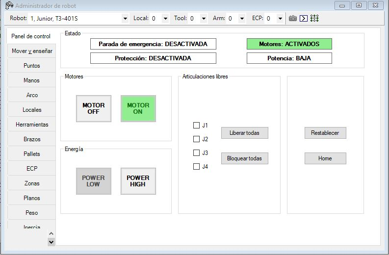

# Laboratorio No. 03
# Robotica Industrial - Analisis y Operacion del Manipulador EPSON T3-401S.

* Omar David Acosta Zambrano

### Cuadro comparativo de características técnicas

| Característica                               | Motoman MH6                                      | ABB IRB 140-6/0.8                               | EPSON T3-401S (SCARA)                                  |
|---------------------------------------------|--------------------------------------------------|-------------------------------------------------|--------------------------------------------------------|
| **Tipo de robot / estructura**              | Articulado de 6 ejes                             | Articulado de 6 ejes                            | SCARA de 4 ejes                                        |
| **Grados de libertad**                      | 6                                                | 6                                               | 4                                                      |
| **Carga útil nominal / máxima**             | 6 kg                                             | 6 kg                                            | 1 kg nominal, 3 kg máxima                              |
| **Alcance máximo horizontal**               | ≈ 1377 mm (1,38 m)                               | 800 mm (0,8 m)                                   | 400 mm (225 mm brazo 1 + 175 mm brazo 2)              |
| **Carrera eje vertical (Z)**                | No aplica como “stroke” especificado (articulado)| No aplica como “stroke” especificado (articulado) | 150 mm en el eje 3 (Z)                                |
| **Repetibilidad (posición)**                | ±0,08 mm aprox.                                  | ±0,03 mm aprox.                                  | ±0,02 mm en ejes 1–3, ±0,02° en eje 4                 |
| **Velocidad máx. en ejes principales**      | Alta, según eje y trayectoria (orden de m/s)     | Alta, según configuración y carga                | J1–J2: hasta 3700 mm/s; J3: 1000 mm/s; J4: 2600 °/s   |
| **Rango típico de movimiento**              | Rotaciones amplias en todos los ejes             | Envolvente compacto con gran rango angular       | J1: ±132°; J2: ±141°; Z: 150 mm; J4: ±360°            |
| **Peso del manipulador**                    | ≈ 130 kg                                         | ≈ 100 kg                                         | 16 kg (sin cables)                                    |
| **Modos de montaje típicos**                | Suelo, pared, techo                              | Suelo, pared, vertical/suspendido               | Montaje sobre bancada o mesa                         |
| **Aplicaciones típicas**                    | Manipulación, soldadura, carga/descarga de máquina, empaquetado | Manipulación, ensamblaje, cuidado de máquina, paletizado ligero | Pick & place de alta velocidad, ensamblaje ligero, manipulación de piezas pequeñas |
| **Entorno y protección**                    | Uso industrial general (según variante)          | Robot IP67; controlador IP54                     | Uso en celdas de automatización ligera, 5–40 °C       |


### Configuraciones *Home* del EPSON T3-401S

En el laboratorio se trabaja con la idea de que el EPSON T3-401S tenga una posición de referencia o **posición Home**, a la cual el robot puede regresar de forma segura antes y después de ejecutar trayectorias.

El T3-401S es un robot SCARA de **4 grados de libertad (J1, J2, J3, J4)**:

- **J1 – Eje de base (rotacional)**  
- **J2 – Eje de brazo (rotacional)**  
- **J3 – Eje vertical Z (lineal)**  
- **J4 – Eje de rotación de herramienta (rotacional)**  

A partir de esto, se suelen manejar dos niveles de referencia:

#### 1. Home de sistema / referencia del manipulador

Corresponde a la configuración de referencia del robot después de la calibración de motores (**MCal**) y del procedimiento de *homing*. En esta configuración, cada eje se ubica en su posición de referencia de fábrica.

De forma general, la posición de cada articulación en este **Home de sistema** se describe así:

- **J1 (base):**  
  - Ángulo cercano a **0°**.  
  - El primer brazo del SCARA queda alineado aproximadamente con el eje **X+** del sistema de coordenadas base del robot.

- **J2 (brazo):**  
  - Ángulo cercano a **0°**.  
  - El segundo brazo se alinea con el primero, de modo que el brazo completo queda totalmente extendido hacia adelante.

- **J3 (eje vertical Z):**  
  - Valor de referencia de **Z = 0** (o la cota definida como referencia vertical en el controlador).  
  - El efector final se sitúa a una **altura segura** sobre la mesa de trabajo, evitando contacto con la superficie.

- **J4 (rotación de herramienta):**  
  - Ángulo cercano a **0°**.  
  - La brida de montaje y la herramienta quedan alineadas con el eje **X** del brazo, es decir, sin giro adicional respecto al brazo.

Esta configuración es la que el controlador considera como **posición de referencia** del manipulador y sirve como base para los movimientos posteriores en coordenadas articulares y cartesianas.

#### 2. Home de trabajo / Home de usuario en EPSON RC+ 7.0

Además del Home de sistema, en el laboratorio se define normalmente una **posición Home de trabajo**, registrada en EPSON RC+ 7.0 como un punto seguro dentro del espacio de trabajo (por ejemplo,


### Procedimiento para realizar movimientos manuales del EPSON T3-401S en EPSON RC+ 7.0

A continuación se describe el procedimiento paso a paso para mover manualmente el manipulador EPSON T3-401S usando el **Robot Manager** de EPSON RC+ 7.0, cambiando entre modos por **articulaciones (Joint)** y **cartesiano (World)**, y realizando **traslaciones y rotaciones en X, Y, Z**.

---

#### 1. Acceso al Robot Manager y habilitación del robot

1. Abrir **EPSON RC+ 7.0**.
2. Crear o abrir un proyecto que tenga configurado el robot T3-401S.
3. Ir al menú **Tools → Robot Manager**.  
4. En la ventana de Robot Manager, seleccionar el robot correspondiente (real o virtual) y verificar que esté **conectado**.
5. Desde la pestaña **Panel de Control**, encender el robot:
   - Liberar paros de emergencia.
   - Activar servomotores / potencia del robot (MOTOR ON).
6. Verificar que no haya errores activos antes de pasar a **Jog & Teach**.

---

#### 2. Ingreso al modo de movimientos manuales (Jog & Teach)

1. En la parte superior de Robot Manager, seleccionar la pestaña **Jog & Teach**.
2. En esta pestaña se muestran:
   - Las coordenadas actuales del robot.
   - Los **pulsadores de JOG** (botones de movimiento).
   - El selector de **modo de movimiento** (World / Joint).
   - Opciones para registrar puntos (*Teach*).

---

#### 3. Cambio entre modos de operación: Joint vs World

En la sección **JOG & TEACH** existen al menos dos modos de movimiento principales:

- **Modo Joint (articulaciones)**  
  - Cada pulsador actúa sobre una única articulación (J1, J2, J3, J4).  
  - Permite girar o desplazar cada eje de forma independiente.  
  - Es útil para aproximar el robot a una postura deseada o para movimientos de ajuste fino de cada articulación.

- **Modo World (cartesiano)**  
  - El software calcula los movimientos de las articulaciones necesarios para que el efector final se mueva **paralelo a los ejes X, Y o Z** del sistema de coordenadas del robot.  
  - Permite realizar movimientos intuitivos de **traslación y rotación** en el espacio cartesiano.

**Para cambiar de modo:**

1. En la pestaña **Jog & Teach**, localizar el selector de modo (normalmente un cuadro de lista o botones etiquetados como **World** y **Joint**).
2. Seleccionar:
   - **Joint** para movimientos por articulaciones.
   - **World** para movimientos cartesianos.
3. Confirmar visualmente que el modo activo cambió (el modo seleccionado queda resaltado en la interfaz).

---

#### 4. Movimientos manuales por articulaciones (modo Joint)

Con el modo Joint activo:

1. En la zona de pulsadores de JOG, seleccionar la articulación que se desea mover:
   - J1 (giro de base).
   - J2 (giro del segundo brazo).
   - J3 (eje vertical Z).
   - J4 (rotación de herramienta).
2. Para cada articulación se disponen dos pulsadores:
   - **+**: movimiento en el sentido positivo del eje.
   - **−**: movimiento en el sentido negativo del eje.
3. Pulsar y mantener presionado el botón **+** o **−** para desplazar la articulación mientras se observa el robot físico o el modelo en el simulador.
4. Soltar el pulsador cuando se alcance la postura deseada.

Este modo es especialmente útil para:
- Llevar el robot a su **posición Home**.
- Evitar zonas de posible colisión ajustando uno a uno los ejes.

---

#### 5. Movimientos cartesianos: traslación en X, Y, Z (modo World)

Con el modo World activo, los pulsadores de JOG se agrupan por ejes cartesianos:

1. Identificar los botones de traslación:
   - **X+ / X−**: desplazan el efector final en la dirección del eje X (adelante/atrás respe


### Niveles de velocidad para movimientos manuales en EPSON RC+ 7.0

En el laboratorio, la velocidad de los movimientos manuales (JOG) del EPSON T3-401S se controla principalmente desde el **Administrador de robot → Panel de control**, usando los botones de **POWER LOW** y **POWER HIGH**.

En la parte superior de esa ventana, en el recuadro **Estado**, aparece el indicador:

- `Potencia: BAJA`  → robot en modo de **velocidad baja**
- `Potencia: ALTA`  → robot en modo de **velocidad alta**

Estos niveles afectan la velocidad con la que se mueve el robot cuando se usan los comandos de JOG en la pestaña **“Mover y enseñar”**.

---

#### 1. Niveles de velocidad: POWER LOW vs POWER HIGH

En el cuadro Energía se tienen dos botones:

- **POWER LOW**  
  - Activa una **potencia/velocidad baja** para los movimientos manuales.  
  - Los desplazamientos son más lentos y suaves.  
  - Es el modo recomendado cuando el robot está cerca de la **cubeta de huevos**, del gripper o de cualquier obstáculo.

- **POWER HIGH**  
  - Activa una **potencia/velocidad alta**.  
  - El robot se mueve mucho más rápido al usar JOG.  
  - Se usa solo para desplazamientos largos en zonas despejadas.

Cuando seleccionas uno de estos botones, el texto de la parte superior cambia, por ejemplo, a `Potencia: BAJA` o `Potencia: ALTA`, indicando claramente qué nivel está activo.



---

#### 2. Proceso para cambiar entre niveles de velocidad

1. Abrir EPSON RC+ 7.0 y entrar al Administrador de robot.
2. En el menú lateral izquierdo, seleccionar “Panel de control”.
3. Verificar en el recuadro Motores que el robot está encendido:
   - Botón MOTOR ON en verde.
   - En el recuadro de Estado debe aparecer `Motores: ACTIVADOS`.
4. En el recuadro Energía:
   - Pulsar **POWER LOW** para trabajar con velocidad baja.  
   - Pulsar **POWER HIGH** para trabajar con velocidad alta.
5. Confirmar el cambio revisando el texto en la parte superior:
   - `Potencia: BAJA`  → estás en modo lento.
   - `Potencia: ALTA`  → estás en modo rápido.

A partir de ese momento, al ir a “Mover y enseñar” y usar los botones de JOG, el robot se moverá con la velocidad correspondiente al nivel de potencia seleccionado.

---

#### 3. Relación con los movimientos manuales (JOG)

- La selección POWER LOW / POWER HIGH afecta tanto:
  - los movimientos por articulaciones (Joint), como  
  - los movimientos en modo cartesiano (World) en X, Y, Z y rotación alrededor de Z.
- No se introduce un valor numérico de porcentaje: el operador elige entre dos modos bien diferenciados de velocidad (baja o alta), que ya están limitados por los parámetros de seguridad del robot.

---

### Funcionalidades principales de EPSON RC+ 7.0 y comunicación con el manipulador

EPSON RC+ 7.0 es el entorno de desarrollo y supervisión para los robots EPSON. Desde este software se gestiona el proyecto del laboratorio: se configura el robot T3-401S, se crean y editan programas en SPEL+, se mueven y enseñan puntos al manipulador y se supervisa el estado del sistema mientras se ejecutan trayectorias.

A nivel de proyecto, EPSON RC+ permite definir el tipo de robot, las herramientas, las entradas y salidas y los programas asociados. Toda esta información se guarda en un proyecto que puede abrirse en cualquier momento para reproducir exactamente la misma configuración del laboratorio.

El Administrador de robot es el centro de control. En la pestaña de Panel de control se encienden y apagan los motores (MOTOR ON/OFF), se selecciona la potencia de trabajo (POWER LOW / POWER HIGH) y se visualiza el estado general: parada de emergencia, protección y nivel de potencia. Desde allí se puede enviar el robot a Home y liberar o bloquear articulaciones. En la pestaña Mover y enseñar se realizan los movimientos manuales (JOG), tanto por articulaciones como en coordenadas cartesianas, y se registran puntos de trabajo que luego se usarán en los programas.

La programación se realiza en el lenguaje **SPEL+**, dentro del editor de EPSON RC+. El usuario escribe secuencias de instrucciones que incluyen movimientos (`MOVE` a puntos enseñados), cambios de velocidad, manejo de entradas y salidas, bucles, condiciones y llamadas a subrutinas. Los programas se organizan en tareas, lo que permite separar, por ejemplo, la lógica principal del ciclo de trabajo de rutinas específicas para el gripper o para verificación de sensores. El entorno también ofrece herramientas de compilación, ejecución y depuración, de modo que es posible arrancar, pausar, detener o avanzar paso a paso por el código.

Otro bloque importante es la enseñanza y gestión de puntos. Con el modo JOG el operador lleva el robot a posiciones de interés (Home, puntos de recogida, puntos de deposición, posiciones de seguridad) y las guarda como P1, P2, etc. Estos puntos pueden verse y editarse numéricamente en coordenadas cartesianas o articulares, y luego se referencian directamente en el programa en SPEL+. De esta manera, el código describe la lógica del movimiento y los puntos almacenan la información geométrica.

EPSON RC+ también incorpora visualización y diagnóstico. El modelo 3D del robot permite seguir la postura del manipulador y revisar trayectorias antes de ejecutarlas en el equipo real. Al mismo tiempo, el software muestra estados de entradas y salidas, alarmas activas, mensajes de error y eventos relevantes (paradas de emergencia, sobrecargas, límites alcanzados), lo que facilita el análisis de fallas y la recuperación a un estado seguro.

En cuanto a la comunicación con el manipulador, EPSON RC+ se ejecuta en el PC y se conecta al controlador del robot (integrado en la base del T3-401S) normalmente a través de Ethernet. Por este canal el software envía programas, configuraciones y órdenes de ejecución (por ejemplo, RUN, STOP o RESET), y recibe en tiempo real la información de estado: posición actual, errores, estado de motores, valores de E/S, entre otros. El controlador, a su vez, es quien se encarga del control en tiempo real de los motores: lee encoders, genera perfiles de velocidad y aceleración, respeta límites articulares y traduce los comandos de alto nivel en referencias para cada articulación. El manipulador físico ejecuta el movimiento y devuelve su posición al controlador, que finalmente la reporta a EPSON RC+.

El proceso para ejecutar movimientos comienza al abrir el proyecto y conectarse al robot. Desde el Administrador de robot se activan los motores y se selecciona el nivel de potencia. Luego, usando *Mover y enseñar*, se definen y almacenan los puntos necesarios. Con esos puntos disponibles se escribe el programa en SPEL+, se compila y se asigna al controlador. Al pulsar RUN, el controlador interpreta el código, calcula las trayectorias y coordina el movimiento del robot con la activación del gripper y demás periféricos. Mientras tanto, EPSON RC+ muestra la línea de programa que se está ejecutando, la postura del robot y el estado de las señales, de modo que el operador puede supervisar todo el ciclo y reaccionar ante cualquier alarma o condición anómala.


### Análisis comparativo: EPSON RC+ 7.0, RoboDK y RobotStudio

EPSON RC+ 7.0 es un entorno muy integrado con los robots EPSON. Su principal ventaja es que permite configurar el controlador, programar en SPEL+, mover el robot y gestionar E/S en una misma interfaz, con el mismo “lenguaje” que usa el manipulador real. La limitación es que solo sirve para robots de la marca EPSON y no está pensado como plataforma genérica de simulación.

RoboDK es una herramienta de simulación y programación offline independiente del fabricante. Permite trabajar con modelos de muchas marcas, generar trayectorias complejas, importar geometría CAD y postprocesar código para distintos controladores. Esa versatilidad lo hace ideal para celdas mixtas y para estudiar alternativas de diseño, aunque la comunicación con el robot real depende de postprocesadores y no es tan directa como en los entornos nativos de cada fabricante.

RobotStudio es el entorno oficial de ABB para sus manipuladores. Su gran fortaleza es el uso del “virtual controller”, que reproduce casi exactamente el comportamiento del controlador real y permite desarrollar, verificar y depurar programas RAPID con mucha fidelidad antes de pasarlos al robot físico. Su principal limitación es que solo aplica a robots ABB, pero dentro de ese ecosistema ofrece herramientas muy potentes para estudiar trayectorias, zonas de trabajo y celdas completas de automatización.


### Diagrama de flujo de la rutina de movimiento de huevos con patron de caballo de ajedrez.

```mermaid
flowchart TD
  A[Inicio] --> B[Ir a posición Home segura]
  B --> C[Inicializar rutas de caballo para Huevo 1 (H1) y Huevo 2 (H2)]
  C --> D[Definir idx = 1 y WHICH = H1]
  D --> E{Quedan posiciones en la ruta?}
  E -->|No| Z[Ir a Home y finalizar rutina]
  E -->|Sí| F[Seleccionar huevo a mover (H1 si WHICH = H1, H2 si WHICH = H2)]
  F --> G[Obtener ORIGEN y DESTINO desde la ruta correspondiente (RutaInvH1 o RutaInvH2)]
  G --> H[Ir a posición segura sobre ORIGEN]
  H --> I[Bajar al casillero ORIGEN y activar vacío (tomar huevo)]
  I --> J[Subir a altura segura]
  J --> K[Ir a posición segura sobre DESTINO]
  K --> L[Bajar al casillero DESTINO y desactivar vacío (soltar huevo)]
  L --> M[Subir a altura segura]
  M --> N[Incrementar idx (idx = idx + 1)]
  N --> O[Alternar WHICH (si era H1 pasa a H2, si era H2 pasa a H1)]
  O --> E

```
