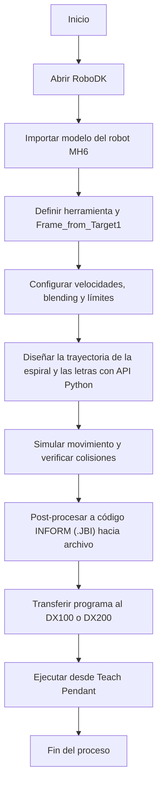

# Laboratorio No. 02
# Robótica Industrial - Análisis y Operación del Manipulador Motoman MH6

* Omar David Acosta Zambrano
* Edgar Esteban Erazo Lagos

# Introducción 
Los manipuladores industriales son brazos robóticos articulados que permiten automatizar tareas repetitivas, de riesgo o que requieren alta precisión, siendo clave en procesos como manufactura, ensamblaje, soldadura o pintura. En esta práctica, el enfoque se centró en el diseño y ejecución de trayectorias polares utilizando el entorno de simulación RoboDK. El objetivo es establecer una base sólida, tanto teórica como práctica, para programar movimientos offline que puedan simularse y ejecutarse físicamente desde el PC. Esto permite comparar el rendimiento y facilidad de uso entre RoboDK y RobotStudio, y entre dos manipuladores industriales distintos: el Yaskawa Motoman MH6 y el ABB IRB 140. Con ello se busca identificar fortalezas, diferencias clave y aplicaciones óptimas de cada herramienta dentro de un entorno de automatización realista.

## Cuadro comparativo con especificaciones técnicas del Motoman MH6 y el IRB140

| Ítem                                      | **Motoman MH6 (DX100/DX200)**                                                | **ABB IRB 140 (IRC5)**                                                                                                   |
| ----------------------------------------- | ---------------------------------------------------------------------------- | ------------------------------------------------------------------------------------------------------------------------ |
| **Grados de libertad / ejes**             | 6                                                                            | 6                                                                                                                        |
| **Carga máxima (payload)**                | **6 kg**                                                                     | **6 kg** ([library.e.abb.com][1])                                                                                        |
| **Alcance horizontal**                    | **1 422 mm**                                                                 | **810 mm (0.8 m)** ([library.e.abb.com][1])                                                                              |
| **Repetibilidad (ISO 9283)**              | **±0.08 mm**                                                                 | **±0.03 mm** (RP); **AP ≈ 0.02 mm** ([library.e.abb.com][1])                                                             |
| **Masa del manipulador**                  | **≈130 kg**                                                                  | **≈98 kg** ([library.e.abb.com][1])                                                                                      |
| **Montaje**                               | Piso, pared, techo (invertido)                                               | Piso, pared/invertido, ángulo; IRB 140T alta velocidad disponible ([library.e.abb.com][1])                               |
| **Rango de rotación por articulación**    | **J1 ±170°, J2 +155/−90°, J3 +250/−175°, J4 ±180°, J5 +225/−45°, J6 ±360°**  | **J1 ±180°, J2 +110/−90°, J3 +50/−230°, J4 ±200° (ampliable), J5 ±115°, J6 ±400° (ampliable)** ([library.e.abb.com][1])  |
| **Velocidad máx. por eje (°/s)**          | **J1 220, J2 200, J3 220, J4 410, J5 410, J6 610**                           | **J1 200, J2 200, J3 260, J4 360, J5 360, J6 450** (3-fase) ([library.e.abb.com][1])                                     |
| **Torque máx. de muñeca**                 | **J4 11.8 Nm, J5 9.8 Nm, J6 5.9 Nm**                                         | **J4 8.58 Nm, J5 8.58 Nm, J6 4.91 Nm** ([library.e.abb.com][1])                                                          |
| **Momento de inercia admisible (muñeca)** | **J4 0.27, J5 0.27, J6 0.06 kg·m²**                                          | **J5 ≤0.42 kg·m², J6 ≤0.30 kg·m²** (cargas/inercia según diagrama) ([library.e.abb.com][1])                              |
| **Protección / variantes**                | Estándar industrial (IP típico)                                              | Variantes **Foundry Plus 2** (IP67 cuerpo-muñeca) y **Clean Room ISO 6** disponibles ([library.e.abb.com][1])            |
| **Controlador**                           | **DX100/DX200** (multi-robot hasta 8/72 ejes)                                | **IRC5 + RobotWare**, opciones Absolute Accuracy, etc. ([library.e.abb.com][1])                                          |
| **Potencia / consumo**                    | **~1.5 kVA** (ficha MH6)                                                     | **Consumo típico**: **0.34–0.44 kW** según velocidad (trayecto ISO) ([library.e.abb.com][1])                             |
| **Aplicaciones típicas**                  | Manipulación, tending, empaque, dosificado, soldadura, etc.                  | Manipulación/ensamble; variantes para fundición y sala limpia; versión 140T para más velocidad. ([library.e.abb.com][1]) |

[1]: https://library.e.abb.com/public/a7121292272d40a9992a50745fdaa3b2/3HAC041346%20PS%20IRB%20140-en.pdf "Product specification - IRB 140"

# Diferencias entre el Home 1 y el Home 2 del Motoman MH6:

Durante el desarrollo del laboratorio, se evaluaron dos posturas HOME disponibles en el entorno de simulación: HOME 1 y HOME 2, cada una con características particulares en términos de estabilidad, consumo energético y funcionalidad operativa.

El HOME 1 es una postura mecánicamente estable pensada para cuando el robot está inactivo. Minimiza el par requerido en las articulaciones, cercano a cero, por lo que en el teach pendant se observa corriente prácticamente nula en los ejes. Esto reduce desgaste de frenos y motores y disminuye el consumo energético durante los periodos de espera o apagado seguro.

El HOME 2 es una postura de trabajo previa al ciclo. Evita singularidades y límites articulares y deja el TCP bien orientado y elevado sobre el área de operación, mejorando la alcanzabilidad de los distintos objetivos con trayectorias más cortas y seguras. En esta posición las articulaciones sí aplican par para mantenerse, por lo que el teach pendant muestra corriente en los ejes.

**Elección justificada**

En el contexto del presente laboratorio, enfocado en la programación de trayectorias polares y la escritura de texto en un plano específico mediante RoboDK, la postura HOME 2 fue la más adecuada.

Esto se debe a que permite iniciar los ciclos desde una posición elevada y bien orientada sobre el plano de trabajo, lo que facilita la generación de trayectorias como espirales y letras sin necesidad de hacer correcciones iniciales o mover manualmente el robot fuera de HOME 1. Mejora la alcanzabilidad y la seguridad cinemática de los movimientos, reduciendo el riesgo de errores como TargetReachError y evitando trayectorias innecesariamente largas o forzadas. Se adapta naturalmente al tipo de movimientos realizados en el ejercicio, en especial al uso de comandos MoveL para trazos lineales, los cuales requieren que el robot esté en una postura libre de restricciones articulares.

Por tanto, aunque HOME 1 es óptima para estados de reposo y seguridad pasiva, se determinó que HOME 2 es la opción más funcional y segura para este tipo de programación de trayectorias activas en un entorno de simulación como RoboDK.

# Procedimiento para movimientos manuales

Se explicará de forma sencilla el procedimiento de jog: articular ↔ cartesiano; traslación y rotación en X/Y/Z.

* **Preparar**; Llave en TEACH. E-Stop liberado y zona despejada.
* **Activar servos**; Pulsa SERVO ON READY hasta ver “Servo ON”..
* **Elegir el modo**; Presiona COORD y selecciona:
* **JOINT (articular: J1–J6).** y **BASE/ROBOT, TOOL o USER (cartesiano: X, Y, Z, Rx, Ry, Rz)**; La selección aparece en la barra superior del display.
* **Mover**; Mantén el hombre muerto en posición media y SHIFT/INTERLOCK; Usa las teclas: X±, Y±, Z± (traslación) y Rx±, Ry±, Rz± (rotación) en cartesiano; En JOINT, esas teclas actúan sobre J1–J6 (S, L, U, R, B, T).
* **Velocidad / parada**; Ajusta con FAST/SLOW (empieza lento); Para detener: suelta el hombre muerto o pulsa HOLD.

# Niveles de velocidad en movimientos manuales
Se dará una explicación completa sobre los niveles de velocidad para movimientos manuales, el proceso para cambiar entre
niveles y cómo identificar el nivel establecido en la interfaz del robot. Por tanto el manipulador permite cuatro niveles de velocidad para movimientos manuales como se muestra en el siguiente cuadro:

| Nivel       | Uso típico                                  | ¿Qué hace diferente?                                                             |
| ----------- | ------------------------------------------- | ----------------------------------------------------------------------------- |
| **INCHING** | Ajustes finos cerca de blancos u obstáculos | Avances muy pequeños por pulsos; máxima precisión.                            |
| **LOW**     | Enseñar puntos con seguridad                | Movimiento lento y controlado.                                                |
| **MEDIUM**  | Desplazamientos moderados en zona despejada | Compensa distancia con control aceptable.                                     |
| **HIGH**    | Traslados largos y despejados               | Velocidad más alta permitida en TEACH (siempre con visibilidad y área libre). |

## RoboDK: funcionalidades, comunicación con Motoman y ejecución de movimientos

RoboDK es un software de simulación y programación offline. Permite construir la celda, definir herramientas (TCP), crear trayectorias y generar programas nativos para distintos robots. También cuenta con una API en Python que usamos para automatizar trayectorias como curvas paramétricas (espirales, texto, etc.).

### Funcionalidades clave

- Modelado de celda: importar modelos CAD, colocar equipos, definir referencias (frames).
- TCP y herramientas: creación desde cero o calibración a partir de medidas reales.
- Programación gráfica: creación de targets, MoveJ/MoveL, ajuste de velocidades, aceleraciones y blending.
- Verificación: simulación con detección de colisiones, chequeo de límites articulares y singularidades. Estimación de tiempo de ciclo.
- Post-proceso: exporta código INFORM (.JBI) para Yaskawa u otros formatos según marca.
- API Python: acceso directo a funciones de movimiento, control de I/O, generación de curvas personalizadas y parametrización de trayectorias.
- Módulos para tareas específicas: mecanizado, corte, pulido, visión artificial, etc.

### Comunicación con el Motoman MH6

**Modo offline (el que se usó):**
1. Se diseña y simula la trayectoria en RoboDK.
2. Se verifica la viabilidad: sin colisiones ni problemas cinemáticos.
3. Se genera el archivo .JBI mediante post-procesamiento.
4. El archivo se transfiere al controlador (DX100/DX200) por USB o red.
5. Se ejecuta desde el teach pendant como cualquier otro programa.

**Modo online (directo desde la PC):**
- Se hace vía red con el robot en modo remoto.
- RoboDK envía comandos en tiempo real (MoveJ, MoveL, etc.).
- Requiere que los servos estén activos. No fue el modo utilizado en esta práctica.

### ¿Qué ocurre durante la ejecución?

1. El robot sigue una secuencia de targets con movimientos MoveJ/MoveL definidos por velocidad y blending.
2. RoboDK calcula la cinemática inversa: valores válidos para las articulaciones J1–J6, evitando zonas no alcanzables o singularidades.
3. Aplica el perfil de velocidad/aceleración y verifica que no haya colisiones.
4. Genera el código INFORM .JBI (offline) o envía instrucciones en vivo (online).
5. El controlador ejecuta la trayectoria con sus propios parámetros de seguridad, tiempos de interpolación y control interno.

## Análisis comparativo entre RoboDK vs RobotStudio:

| Criterio                     | **RoboDK**                                                                                               | **RobotStudio (ABB)**                                                                                       |
| ---------------------------- | -------------------------------------------------------------------------------------------------------- | ----------------------------------------------------------------------------------------------------------- |
| **Compatibilidad**           | Multimarca (ABB, Yaskawa/Motoman, KUKA, Fanuc, UR, etc.)                                                 | Exclusivo ABB (IRB, GoFa, SWIFTI, etc.)                                                                     |
| **Modelo de control**        | Simulador propio + drivers para conexión online; genera código nativo vía **post-procesadores**          | **Controlador Virtual (VC)** que replica el firmware del IRC5/OmniCore; corre **RAPID** real                |
| **Programación**             | Gráfica (targets, MoveJ/MoveL) + **API Python** (trayectorias paramétricas, automatización)              | Gráfica + edición completa de **RAPID**, *PickMaster*, *PowerPac* (Path, Arc, Cut, Machine Tending, etc.)   |
| **Generación de código**     | Sí (INFORM para Yaskawa, RAPID para ABB, KRL, TP, etc.)                                                  | Sí (RAPID nativo, carga directa al VC o al controlador)                                                     |
| **Calibración/Exactitud**    | Calibración de TCP/frames; exactitud depende del post y del robot                                        | Soporta **Absolute Accuracy**, *Tune Master*, parámetros de robot reales; alta fidelidad de trayectoria     |
| **Colisiones/Límites**       | Chequeo de colisiones, límites, singularidades; estimación de tiempo de ciclo                            | Chequeo de colisiones y límites con el **VC**; tiempos muy cercanos al robot real                           |
| **Integraciones de proceso** | Módulos para mecanizado, corte, pulido, seguimiento de curvas, visión; importación CAD                   | *PowerPacs* específicos ABB (Arc, Spot, Cut, Bin Picking, etc.); *Smart Components* y señales I/O virtuales |
| **Conexión online**          | Posible (drivers); envía comandos en tiempo real a varios controladores                                  | Posible (ABB PC SDK/Online); descarga y depuración directa de RAPID                                         |
| **Curva de aprendizaje**     | Baja–media (especialmente con la API Python)                                                             | Media–alta si se explota RAPID y los PowerPacs                                                              |
| **Casos de uso típicos**     | Laboratorios académicos multimarca, células mixtas, generación rápida de programas para distintos robots | Producción y *commissioning* **ABB**, validación fiel de lógicas RAPID/I/O, depuración previa a planta      |

### RoboDK — Ventajas

- **Multimarca:** permite trabajar con robots de diferentes fabricantes desde la misma estación.
- **API Python:** ideal para generar trayectorias paramétricas como espirales, rosas polares o nombres personalizados. También útil para automatizar tareas y flujos.
- **Post-procesadores:** genera código nativo para muchos controladores (ABB, Yaskawa, KUKA, etc.), útil en entornos mixtos.
- **Sencillez:** tiene una curva de aprendizaje baja. Es fácil de modelar, simular y programar con interfaz gráfica. Funciona muy bien para docencia, pruebas y prototipos rápidos.

### RoboDK — Limitaciones

- **Fidelidad de ejecución:** la precisión del robot simulado no siempre es igual al comportamiento real, ya que depende del post-procesador y no existe un “firmware virtual” que imite el controlador.
- **Herramientas de proceso:** tiene menos herramientas avanzadas en comparación con los PowerPacs de ABB (por ejemplo, para soldadura, seguimiento de curvas, visión, etc.).

### RobotStudio — Ventajas

- **Controlador Virtual:** ejecuta el mismo código RAPID que corre en el robot real, con cinemática y tiempos precisos. Tiene alta fidelidad entre simulación y ejecución real.
- **Integración con ecosistema ABB:** permite usar PowerPacs, Smart Components, I/O virtual, generación de trayectorias complejas, PickMaster y otras herramientas específicas de ABB.
- **Absolute Accuracy:** permite trabajar con utilidades de calibración y simulación con alta precisión, útil para celdas reales exigentes.

### RobotStudio — Limitaciones

- **Monomarca:** solo funciona con robots ABB. No sirve si se trabaja con Yaskawa, KUKA, Fanuc, etc.
- **Curva de aprendizaje:** para aprovecharlo bien hay que dominar RAPID y entender la lógica del entorno ABB, lo que toma más tiempo.

## Diagrama de flujo

El siguiente diagrama resume la secuencia general seguida en RoboDK para la generación, simulación y ejecución del programa sobre el Motoman MH6.  
Incluye las etapas desde la definición del entorno hasta la ejecución final en el controlador.

## Plano de planta

Respecto al espacio de trabajo configurado en RoboDK, se adjunta la vista de planta donde se visualiza el robot **Motoman MH6**, la base de referencia y la herramienta (**Ventosas**), junto con la pieza de trabajo sobre la cual se trazó la espiral y los nombres.  
La disposición garantiza un área libre de colisiones y un acceso directo del TCP a la superficie, manteniendo la orientación correcta de los ejes X, Y y Z del frame de escritura (`Frame_from_Target1`).

En esta configuración, el texto se ubica en la esquina inferior izquierda del bloque, con la dirección de escritura **de izquierda a derecha**, coherente con el plano XY del frame local.  
La trayectoria de los nombres (“ESTEBAN” y “DAVID”) se diseñó sobre este mismo plano, lo que asegura continuidad y evita conflictos de orientación entre letras.  
Durante las pruebas se comprobó que la referencia del frame y la orientación del TCP permitían mantener la normal del plano perpendicular a la superficie, evitando colisiones y garantizando un trazo fluido.

### Justificación de la ubicación de los nombres
- La guía del laboratorio pide “**bajo** la trayectoria polar”. En nuestra estación, *bajo* se interpreta como **la zona más cercana al observador** en la vista de trabajo, que coincide con la dirección **−Y del frame local**.  
- Mantener los nombres en esa franja evita tocar la espiral (que ya funcionaba) y **no exige reubicar ni reorientar el frame**, lo que antes generó errores de alcance (`TargetReachError`) y comportamientos inestables.
- Al permanecer **en el mismo frame** y **dentro del área de alcanzabilidad** del MH6, se preserva la orientación del TCP (normal al plano), el blending y la continuidad de los `MoveL`, sin colisiones.
- La escritura se mantiene **de izquierda a derecha (eje +X del frame)**. Esta decisión resuelve el problema original de texto “vertical” sin afectar la trayectoria polar ni la simulación ya validada.

> Resultado: los nombres (“ESTEBAN” y “DAVID”) se ubican **debajo** de la espiral en el sentido del frame (zona cercana al observador), legibles de **izquierda a derecha**, y sin re-trabajar la espiral ni el frame de referencia.

## Código en Python para RoboDK

El código realizado en RoboDK para el desarrollo de la actividad se puede encontrar dentro de la carpeta llamada *"Codigo"*.

## Videos explicativos

Para un mayor detalle de la actividad realizada, se puede observar un video de la implementación de este laboratorio en los siguientes enlaces:
Ejecución del archivo realizado en RoboDK en el Robot MH6: [aquí](https://youtu.be/zrzwGteLY6I?si=l5BrRWUka7MFLQh8)
Simulación del código en RoboDK y explicación del código:  [aquí](https://youtu.be/D21bzQpL9eI)

