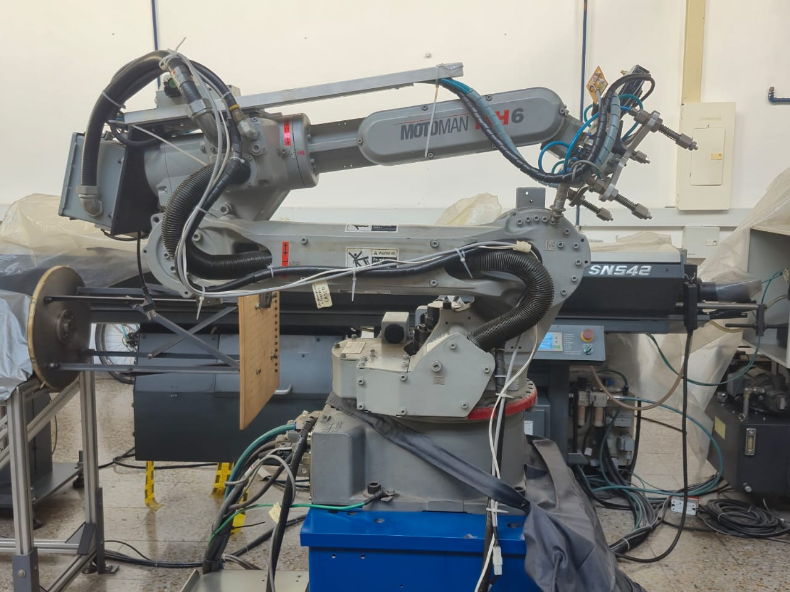
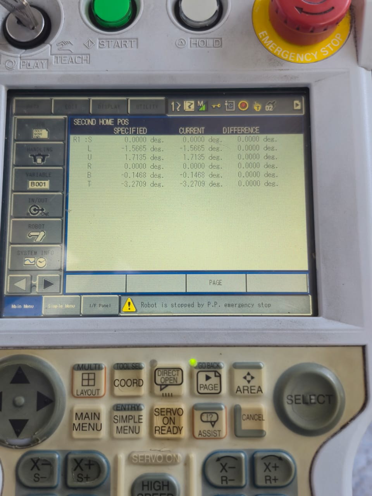
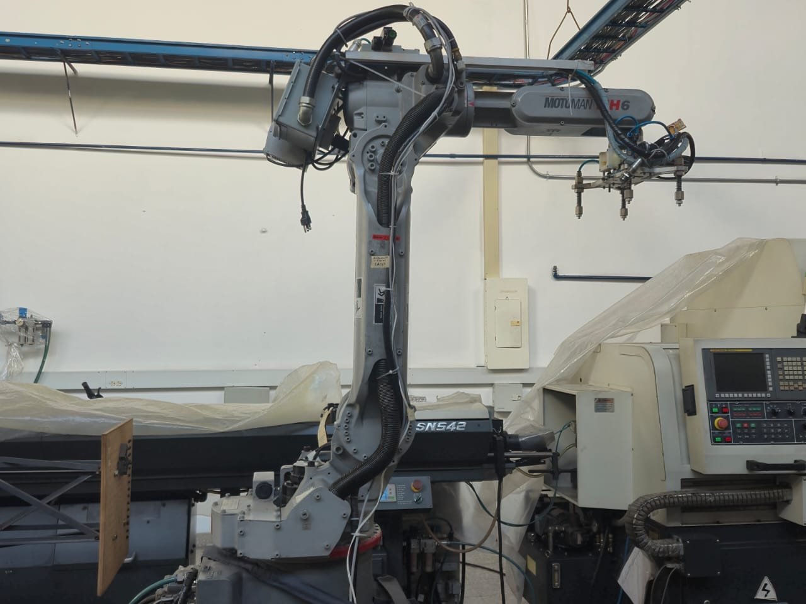
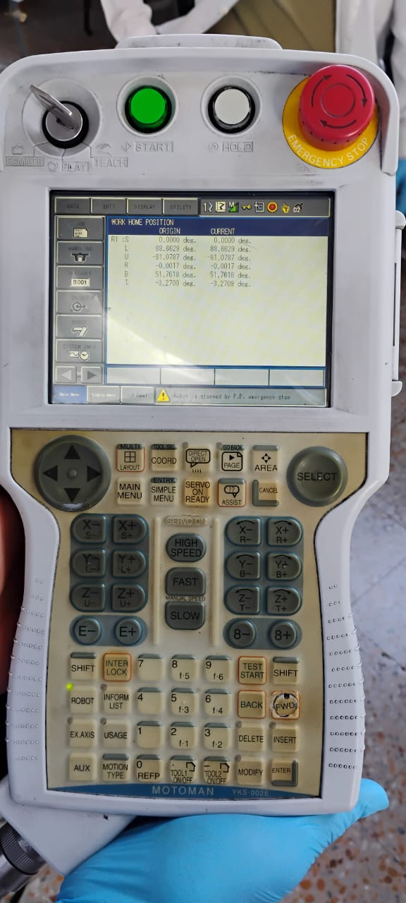

# Laboratorio 2
1)cuadro comparativo especificaciones técnicas del Motoman MH6 y el IRB140

| Ítem                                      | **Motoman MH6 (DX100/DX200)**                                                | **ABB IRB 140 (IRC5)**                                                                                                   |
| ----------------------------------------- | ---------------------------------------------------------------------------- | ------------------------------------------------------------------------------------------------------------------------ |
| **Grados de libertad / ejes**             | 6                                                                            | 6                                                                                                                        |
| **Carga máxima (payload)**                | **6 kg**                                                                     | **6 kg** ([library.e.abb.com][1])                                                                                        |
| **Alcance horizontal**                    | **1 422 mm**                                                                 | **810 mm (0.8 m)** ([library.e.abb.com][1])                                                                              |
| **Repetibilidad (ISO 9283)**              | **±0.08 mm**                                                                 | **±0.03 mm** (RP); **AP ≈ 0.02 mm** ([library.e.abb.com][1])                                                             |
| **Masa del manipulador**                  | **≈130 kg**                                                                  | **≈98 kg** ([library.e.abb.com][1])                                                                                      |
| **Montaje**                               | Piso, pared, techo (invertido)                                               | Piso, pared/invertido, ángulo; IRB 140T alta velocidad disponible ([library.e.abb.com][1])                               |
| **Rango de rotación por articulación**    | **J1 ±170°, J2 +155/−90°, J3 +250/−175°, J4 ±180°, J5 +225/−45°, J6 ±360°**  | **J1 ±180°, J2 +110/−90°, J3 +50/−230°, J4 ±200° (ampliable), J5 ±115°, J6 ±400° (ampliable)** ([library.e.abb.com][1])  |
| **Velocidad máx. por eje (°/s)**          | **J1 220, J2 200, J3 220, J4 410, J5 410, J6 610**                           | **J1 200, J2 200, J3 260, J4 360, J5 360, J6 450** (3-fase) ([library.e.abb.com][1])                                     |
| **Torque máx. de muñeca**                 | **J4 11.8 Nm, J5 9.8 Nm, J6 5.9 Nm**                                         | **J4 8.58 Nm, J5 8.58 Nm, J6 4.91 Nm** ([library.e.abb.com][1])                                                          |
| **Momento de inercia admisible (muñeca)** | **J4 0.27, J5 0.27, J6 0.06 kg·m²**                                          | **J5 ≤0.42 kg·m², J6 ≤0.30 kg·m²** (cargas/inercia según diagrama) ([library.e.abb.com][1])                              |
| **Protección / variantes**                | Estándar industrial (IP típico)                                              | Variantes **Foundry Plus 2** (IP67 cuerpo-muñeca) y **Clean Room ISO 6** disponibles ([library.e.abb.com][1])            |
| **Controlador**                           | **DX100/DX200** (multi-robot hasta 8/72 ejes)                                | **IRC5 + RobotWare**, opciones Absolute Accuracy, etc. ([library.e.abb.com][1])                                          |
| **Potencia / consumo**                    | **~1.5 kVA** (ficha MH6)                                                     | **Consumo típico**: **0.34–0.44 kW** según velocidad (trayecto ISO) ([library.e.abb.com][1])                             |
| **Aplicaciones típicas**                  | Manipulación, tending, empaque, dosificado, soldadura, etc.                  | Manipulación/ensamble; variantes para fundición y sala limpia; versión 140T para más velocidad. ([library.e.abb.com][1]) |

[1]: https://library.e.abb.com/public/a7121292272d40a9992a50745fdaa3b2/3HAC041346%20PS%20IRB%20140-en.pdf "Product specification - IRB 140"

2) Diferencias entre el home1 y el home2 del Motoman MH6:
   Es una postura mecánicamente estable pensada para cuando el robot está inactivo. Minimiza el par requerido en las articulaciones (cercano a cero), por lo que en el teach pendant se observa corriente prácticamente nula en los ejes. Esto reduce desgaste de frenos y motores y disminuye el consumo energético durante los periodos de espera o apagado seguro.

Es una postura de trabajo previa al ciclo. Evita singularidades y límites articulares y deja el TCP bien orientado y elevado sobre el área de operación, mejorando la alcanzabilidad de los distintos objetivos con trayectorias más cortas y seguras. En esta posición las articulaciones sí aplican par para mantenerse, por lo que el teach pendant muestra corriente en los ejes.

3) Procedimiento para realizar el movimiento manual del manipulador Motoman por articulaciones, cambiar a movimientos cartesianos y realizar movimientos de traslación y rotación en los ejes X, Y, Z.

Iniciamos  poniendo la llave de modos de funcionamiento en TEACH y ver que el E-Stop esté liberado y el área despejada.

Procedemos a encender servos. para eso pulsamos SERVO ON READY hasta que aparezca “Servo ON”.

Luego elegimos cómo mover. Presiona COORD para alternar entre JOINT (articular) o BASE/ROBOT, TOOL o USER (cartesiano) — se ve en la barra del display.

luego ejecutamos el jog. para eso mantenemos presionado el boton de hombre muerto (enabling switch) y SHIFT/INTERLOCK; luego usa las teclas:

    X±, Y±, Z± = traslaciones; Rx±, Ry±, Rz± = rotaciones (en cartesiano).

    En JOINT, esas mismas teclas actúan sobre J1–J6 (S,L,U,R,B,T).

Ajustar velocidad. Cambia con FAST/SLOW (empieza lento).

Para detener con seguridad. Se duelta el boton de hombre muerto o se pulsa la parada de emergencia; el robot se detiene de inmediato.
