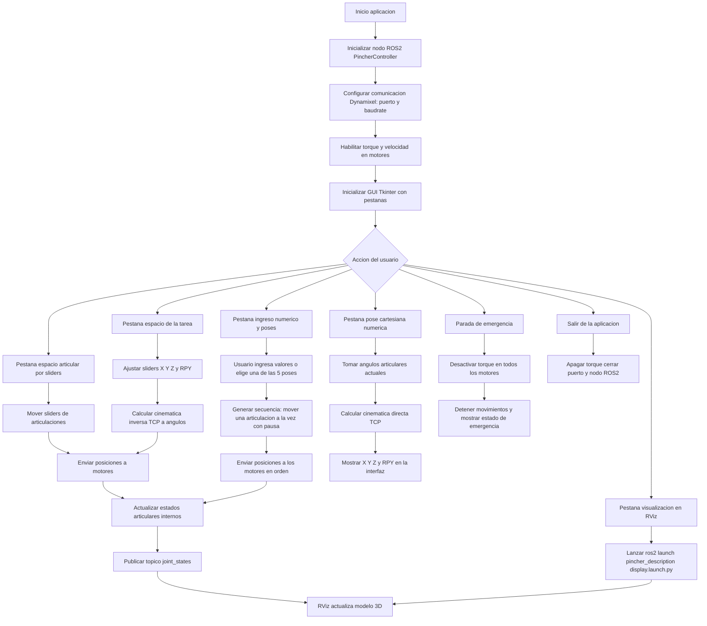
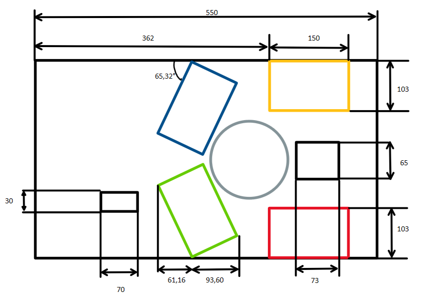

## Descripción detallada de la solución planteada

La solución propuesta para el Laboratorio No. 05 integra en un mismo proyecto el control del manipulador Phantom X Pincher X100 con servomotores Dynamixel AX-12, el uso de ROS 2 Humble y la visualización en RViz, todo operado desde una interfaz HMI desarrollada en Python.

En primer lugar, se implementa un nodo de ROS 2 en Python (PincherController) que se comunica directamente con los servomotores a través de la librería dynamixel_sdk. Este nodo configura el puerto serie, la velocidad en baudios y los IDs de cada motor, y habilita el torque, la velocidad y los límites de operación. El controlador ofrece funciones para mover articulaciones individuales, enviar comandos simultáneos a todas las juntas, llevar el robot a una posición HOME y ejecutar una parada de emergencia que desactiva el torque cuando sea necesario. Además, el nodo publica de forma periódica el estado articular real en el tópico /joint_states, convirtiendo los valores en “ticks” de los Dynamixel a radianes y respetando el signo de cada articulación para que la representación en RViz coincida con el movimiento físico.

Sobre este controlador se construye la interfaz gráfica de usuario (PincherGUI), desarrollada en tkinter con un sistema de pestañas. En la parte superior de la ventana se muestran los datos del integrante del grupo (Omar David Acosta Zambrano) y el logo de la Universidad, cumpliendo el requisito de identificación del autor. La GUI incluye botones globales de HOME y parada de emergencia, así como mensajes de estado que informan al usuario sobre la ejecución de los movimientos y posibles errores.

La primera pestaña implementa el control en espacio articular mediante deslizadores: cada articulación cuenta con un slider que permite modificar su posición dentro de un rango seguro, de forma que no se excedan los límites físicos del manipulador. Al mover un slider, se envía el comando correspondiente al nodo de ROS 2 y se actualiza el valor mostrado para esa articulación. La segunda pestaña corresponde al ingreso numérico articular: el usuario puede escribir los valores deseados (en ticks) para cada motor y mover una junta de manera individual o enviar un comando conjunto para todas las articulaciones, lo que facilita reproducir configuraciones específicas de prueba.

Adicionalmente, en la pestaña de ingreso numérico se implementa la selección de poses predefinidas. Se programan cinco configuraciones articulares basadas en los ángulos sugeridos en el enunciado del laboratorio (0, 25, −35, 85, 80 grados, etc.), trasladadas a la escala de los servomotores tomando como referencia la posición HOME en 512 ticks. Cada vez que el usuario selecciona una pose, el sistema mueve el robot de forma secuencial: primero se posiciona la base, luego el hombro, codo, muñeca y finalmente el efector final, insertando una pausa de un segundo entre articulaciones para facilitar la observación y la grabación de video. Esto permite demostrar claramente que el robot alcanza cada una de las cinco configuraciones requeridas.

La tercera pestaña corresponde a la visualización en RViz. Desde esta pestaña se puede lanzar, mediante un proceso externo, el archivo de lanzamiento display.launch.py del paquete de descripción del Phantom X Pincher. Este launch inicia robot_state_publisher y RViz con el modelo URDF del manipulador. Gracias a la publicación continua de /joint_states desde el nodo PincherController, los movimientos ejecutados en la GUI se reflejan en tiempo real en el modelo 3D mostrado en RViz, permitiendo comparar la configuración del robot físico con su representación virtual.

Finalmente, la arquitectura del proyecto está pensada para integrarse con un módulo de cinemática directa basado en la tabla DH medida en el laboratorio. A partir de los valores articulares reales (leídos desde los tópicos de los controladores), este módulo permite calcular la pose cartesiana del TCP (posición X, Y, Z y orientación en ángulos Roll-Pitch-Yaw). Con estos resultados se puede completar la pestaña de control en el espacio de la tarea (sliders en X, Y, Z y RPY) y la pestaña de visualización numérica de la pose cartesiana, cumpliendo así todos los requisitos planteados en la guía del laboratorio.

## Diagrama de flujo de la solucion planteada

## Plano de planta

## Descripción de las funciones utilizadas

La solución de este laboratorio se implementa en un script principal en Python que combina:

- Un nodo ROS 2 para el control de los servomotores Dynamixel del Phantom X Pincher.  
- Una HMI (interfaz gráfica) desarrollada en Tkinter, organizada en pestañas.  
- Publicación continua de `joint_states` para la visualización del modelo en RViz.  

A continuación se describen las funciones y clases más relevantes del código.

---

### Funciones auxiliares de bajo nivel

- `write_goal_position(packet, port, dxl_id, position)`  
  Escribe en el registro de posición objetivo del servomotor indicado. Abstrae las diferencias entre AX-12 y XL430 (2 bytes o 4 bytes según el modelo).

- `write_moving_speed(packet, port, dxl_id, speed)`  
  Configura la velocidad de movimiento de un servomotor. Se usa tanto en la inicialización como cuando el usuario modifica la velocidad desde la HMI.

- `read_present_position(packet, port, dxl_id)`  
  Lee la posición actual (en “ticks” Dynamixel) de un motor. Esta lectura se utiliza para actualizar la información que se publica en `/joint_states` y para mostrar en la interfaz el estado real de cada articulación.

---

### Nodo ROS 2: `PincherController`

- `__init__(...)`  
  Inicializa el nodo `pincher_controller`, declara parámetros (puerto serie, baudrate, IDs de motores, posiciones iniciales, límites de torque y velocidad) y establece la comunicación con los servomotores Dynamixel.  
  Configura el puerto (`PortHandler`), el `PacketHandler`, habilita el torque de todos los motores, aplica la velocidad inicial y crea el publicador de `JointState` en el tópico `/joint_states`. También arranca un temporizador para publicar periódicamente el estado articular.

- `initialize_motors(goal_positions, moving_speed, torque_limit)`  
  Recorre la lista de IDs de motores y para cada uno:
  1. Habilita el torque.  
  2. Configura la velocidad de movimiento.  
  3. (Cuando aplica) fija el límite de torque.  
  4. Envía una posición inicial (HOME, centrada en `DEFAULT_GOAL`).  
  De esta forma el manipulador queda listo para recibir comandos desde la HMI.

- `dxl_to_radians(dxl_value)`  
  Convierte un valor de posición Dynamixel (en ticks) a radianes, considerando el rango útil de giro del Phantom X. El resultado se usa para construir el mensaje `JointState` y que RViz muestre el modelo con ángulos coherentes.

- `radians_to_dxl(radians)`  
  Opera de forma inversa a la función anterior: convierte un ángulo en radianes a un valor de ticks para los servos. Esta conversión es necesaria en los modos de control en espacio de la tarea, donde se calculan ángulos articulares a partir de una posición cartesiana.

- `publish_joint_states()`  
  Se ejecuta periódicamente gracias a un `timer` de ROS 2. Para cada motor:
  1. Lee la posición actual con `read_present_position`.  
  2. Convierte el valor de ticks a radianes (`dxl_to_radians`).  
  3. Ajusta el signo según el mapa `joint_sign`.  
  Con esos datos construye y publica un mensaje `sensor_msgs/JointState` con los nombres de articulación (`waist`, `shoulder`, `elbow`, `wrist`, `gripper`) y sus posiciones. Este tópico alimenta tanto la pestaña de visualización numérica como RViz.

- `move_motor(motor_id, position)`  
  Envía una nueva posición objetivo a un motor individual, siempre que la parada de emergencia no esté activa. Actualiza el vector de posiciones articulares internas para mantener sincronizada la información que se publica en `/joint_states`.

- `move_all_motors(positions)`  
  Permite mover todos los motores a un conjunto de posiciones articulares, típicamente cuando se selecciona una de las cinco poses del laboratorio o cuando se envía una configuración calculada en el espacio de la tarea.

- `update_speed_single_motor(motor_id, speed)` y `update_speed(speed)`  
  Actualizan la velocidad de movimiento, ya sea para un solo motor o para todos. Estas funciones se invocan cuando el usuario manipula los sliders de velocidad en la HMI.

- `home_all_motors()`  
  Envía a todos los motores a la posición HOME (valor `DEFAULT_GOAL`), respetando el estado de emergencia. Se utiliza desde el botón HOME de la interfaz para devolver el robot a una configuración segura y conocida.

- `emergency_stop()`  
  Desactiva el torque en todos los servos y marca el flag interno de parada de emergencia. A partir de ese momento se bloquean los comandos de movimiento hasta que se reactive el torque.

- `reactivate_torque()`  
  Vuelve a habilitar el torque de todos los motores para salir del estado de emergencia y restaurar el control del manipulador.

- `close()`  
  Apaga el torque, cierra el puerto serie y deja el nodo listo para ser destruido. Se utiliza al cerrar la aplicación para garantizar un apagado seguro del sistema.

---

### Interfaz gráfica: `PincherGUI`

- `__init__(controller)`  
  Crea la ventana principal en Tkinter y asocia el nodo `PincherController`.  
  Configura el `Notebook` con las diferentes pestañas (control articular por sliders, ingreso numérico articular, control en espacio de la tarea, visualización en RViz y visualización numérica de la pose cartesiana).  
  Inicializa estructuras de datos para recordar la última actualización de cada slider, controlar la frecuencia de envío de comandos y gestionar el proceso externo de RViz. También configura el encabezado de la HMI con el nombre del estudiante: **Omar David Acosta Zambrano**.

- `setup_tab1()`  
  Construye la pestaña de **control en espacio articular mediante deslizadores**.  
  Para cada uno de los 5 motores:
  - Crea un slider con el rango permitido (en ticks) para evitar choques mecánicos.  
  - Muestra una etiqueta con la posición actual.  
  Incluye un control de velocidad global para esta pestaña y gestiona el envío de comandos de movimiento casi en tiempo real mientras se mueven los sliders.

- `setup_tab2()`  
  Implementa la pestaña de **ingreso numérico articular**.  
  Para cada articulación:
  - Muestra un campo de texto donde el usuario introduce el valor de posición (en ticks).  
  - Ofrece un botón para mover solo ese motor a la posición indicada.  
  Incluye además:
  - Un botón para mover **todos los motores** con los valores escritos.  
  - La sección de **poses predefinidas** del laboratorio (Posición 1 a Posición 5).  
  Al seleccionar una de estas poses, el robot se mueve de forma secuencial: una articulación a la vez, con una pausa de un segundo entre cada movimiento, partiendo de la posición HOME centrada en 512 para cada motor.

- `setup_tab3()`  
  Configura la pestaña de **visualización en RViz**.  
  Contiene:
  - Un botón para lanzar `ros2 launch pincher_description display.launch.py`, que inicia `robot_state_publisher` y RViz con el modelo del Phantom X Pincher.  
  - Un botón para detener RViz.  
  - Un cuadro de estado que indica si RViz está corriendo o detenido.  
  - Un panel con las posiciones actuales de cada articulación (en radianes), leídas del vector `current_joint_positions` del controlador.

- `setup_tab4()` *(si se implementa en el código)*  
  Implementa la pestaña de **control en el espacio de la tarea**.  
  Incluye sliders para:
  - Traslación del TCP en X, Y, Z.  
  - Rotaciones del TCP en Roll, Pitch y Yaw.  
  A partir de estos valores, se calcula la cinemática inversa del Phantom X para obtener los ángulos articulares necesarios y se envían al nodo `PincherController` para que el manipulador se mueva a la pose cartesiana deseada.

- `setup_tab5()` *(si se implementa en el código)*  
  Corresponde a la pestaña de **visualización numérica de la pose cartesiana**.  
  Muestra en tiempo real:
  - La posición del TCP en X, Y y Z.  
  - La orientación del TCP en términos de ángulos Roll-Pitch-Yaw.  
  Estos valores se obtienen a partir de la cinemática directa del robot usando las posiciones articulares actuales.

- `launch_rviz()` / `stop_rviz()` / `on_rviz_closed()`  
  Gestionan el lanzamiento y cierre del proceso de RViz desde la interfaz, así como la actualización del estado mostrado al usuario.

- `update_joints_timer()`  
  Actualiza periódicamente las etiquetas de posición articular en la HMI, utilizando el vector `current_joint_positions` del nodo controlador.

- `on_motor_slider_change(motor_id)`  
  Callback asociado a los sliders de la pestaña articular.  
  Controla la frecuencia de envío de comandos (para no saturar el bus) y envía nuevos valores de posición al nodo ROS siempre que la velocidad sea mayor que cero y no haya parada de emergencia activa.

- `on_speed_slider_change(value)`  
  Mantiene sincronizados los controles de velocidad de las distintas pestañas y llama a `update_speed` en el nodo controlador.

- `move_single_motor_from_entry(motor_id)` y `move_all_motors_from_entries()`  
  Procesan los valores escritos en los campos numéricos de la pestaña articular, validan el rango, envían los comandos al controlador y actualizan el estado visual de la interfaz.

- `move_to_preset(positions)`  
  Envía al manipulador a una de las poses predefinidas del laboratorio. La secuencia mueve primero una articulación, espera un segundo y luego pasa a la siguiente, hasta completar las cinco articulaciones. También sincroniza sliders y campos numéricos con la nueva configuración alcanzada.

- `home_all()`  
  Envía al robot a la posición HOME. Actualiza sliders, campos numéricos y etiquetas de estado para indicar que el manipulador se encuentra en una configuración segura.

- `emergency_stop()`  
  Activa la parada de emergencia desde la HMI, llamando al método correspondiente del nodo controlador y actualizando todas las etiquetas relacionadas con el estado del sistema.

- `on_close()`  
  Maneja el cierre de la ventana principal. Si RViz está ejecutándose, lo detiene primero, y luego apaga el torque, cierra la comunicación con los servos y detiene el nodo ROS 2.

- `run()`  
  Inicia el bucle principal de la interfaz Tkinter.

---

### Función `main(...)`

- `main(args=None)`  
  Inicializa ROS 2, crea una instancia de `PincherController` y lanza `rclpy.spin()` en un hilo en segundo plano.  
  En el hilo principal arranca la HMI (`PincherGUI`) y, al finalizar la ejecución, se encarga de cerrar correctamente el puerto, destruir el nodo y apagar el sistema ROS 2.

## Código 

El código realizado en RoboDK para el desarrollo de la actividad se puede encontrar dentro de la carpeta llamada *"Codigo"*.

## Video
Por cuestiones de tiempo y falta de disponibilidad de los robots para realizar la pracctica no se logro implementar y probar el codigo
