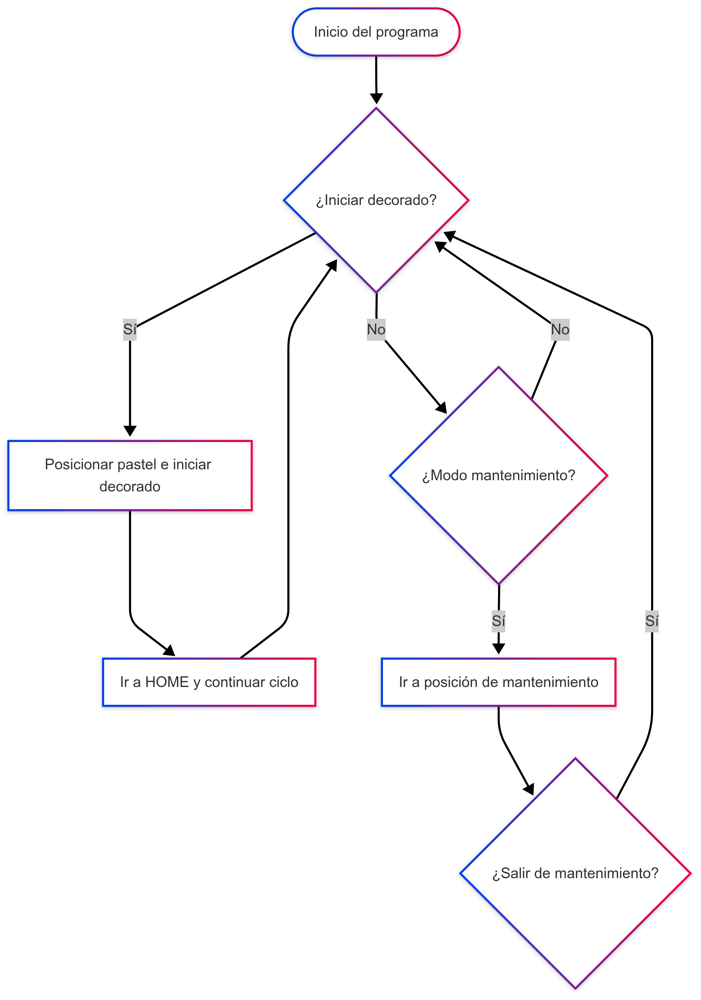
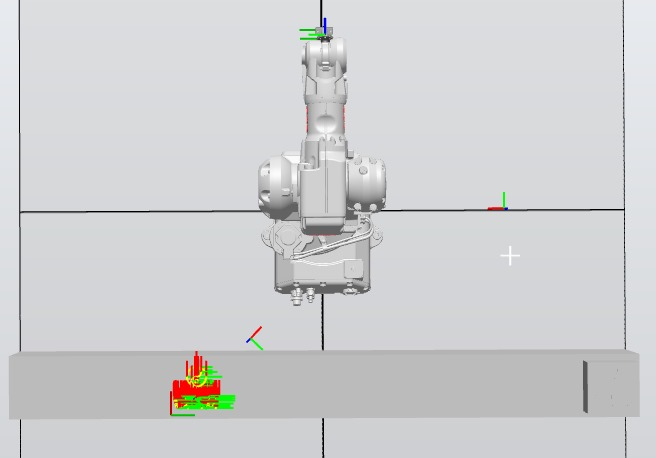
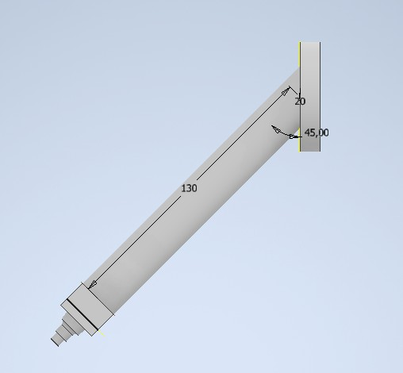
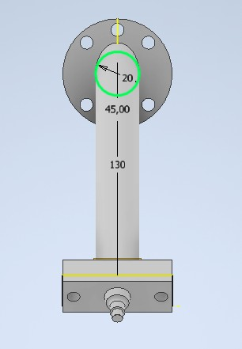

# Laboratorio No. 01
# Robótica Industrial- Trayectorias, Entradas y Salidas Digitales.

* Omar David Acosta Zambrano
* Edgar Esteban Erazo Lagos

## Descripción del sistema y operaciones

**Introducción**

En este laboratorio se desarrolla la automatización del proceso de decoración de un pastel utilizando un manipulador industrial ABB simulado en RobotStudio, programado en lenguaje RAPID.
El objetivo principal es comprender la lógica de control de un robot de seis ejes, integrando señales digitales, trayectorias programadas y modos de operación diferenciados.
A través de la simulación se buscó aplicar conceptos de seguridad, homing, coordinación con una banda transportadora y control secuencial de tareas, replicando el comportamiento de una célula industrial real.

**Objetivo general**

El propósito de este laboratorio fue diseñar e implementar un sistema automatizado para decorar un pastel usando RobotStudio con un robot ABB. Debía respetar las restricciones definidas: velocidades entre **100 y 1000 mm/s**, zona de precisión menor o igual a **z10**, retorno a la posición *HOME* con todas las articulaciones en 0°, manejo de dos entradas y dos salidas digitales, y control de la banda transportadora para despachar el pastel al final de la decoración.

**Arquitectura de la celda**

La celda consta de un robot ABB simulado (controlador IRC5), una herramienta denominada *Porta_Marcador* y un *WorkObject_2* situado sobre la banda o pastel.
El *Porta_Marcador* define el TCP y la orientación de escritura del marcador. El *WorkObject_2* fija las referencias del proceso: todas las trayectorias se definen respecto a ese sistema de coordenadas, lo que facilita que puedan cambiarse posiciones del pastel sin reprogramar cada punto.

Además, se definieron puntos clave para seguridad y funcionamiento:

* **Target_No_Golpear**, para evitar colisiones al entrar o salir del área de decoración.
* **Target_Pastel_Inicio**, punto de acceso a la zona donde se decorará.
* **Target_Mantenimiento**, lugar seguro para intervención del operador.
* **HOME** y **HOME_IR**, posiciones de retorno estándar (HOME_IR con articulaciones a 0°).


**Entradas, salidas y modo de operación**

Se usan dos señales de entrada digital:

* *DI_01* para iniciar el ciclo de producción,
* *DI_02* para cambiar al modo mantenimiento.

Las salidas digitales incluyen:

* *DO_01*: indicadora del robot activo,
* *DO_02*: indicadora de mantenimiento,
* *Conveyor_FWD*: activa la banda hacia el despacho,
* *Conveyor_INV*: queda como reserva.

En cada inicio de ciclo se ejecuta *Reset* sobre todas esas salidas (DO_01, DO_02, Conveyor_FWD, Conveyor_INV) para asegurar que el sistema empiece en estado seguro.


**Estrategia de homing y referencias**

El robot tiene dos modos de *homing*. Primero, *HOME_IR* es una posición articular con todas las articulaciones en 0°, ejecutado con *MoveAbsJ*. Luego, *HOME* es una posición cartesiana despejada usada para desplazamientos seguros.
La posición de mantenimiento (*Target_Mantenimiento*) se diseña para que el operador pueda intervenir con comodidad y sin riesgos. *Target_No_Golpear* actúa como punto intermedio para evitar que la herramienta cruce directamente zonas sensibles del pastel.


**Tool y WorkObject**

El *Porta_Marcador* recoge el desplazamiento geométrico hacia la punta del marcador y su orientación de escritura.
El *WorkObject_2* fija el sistema de coordenadas del pastel o banda, de modo que las trayectorias (Paths) usen siempre la misma referencia. Esto permite mover la pieza de trabajo, replicar el diseño o ajustar la posición sin tener que reprogramar los puntos del robot.


**Trayectorias de proceso**

Cada figura o letra se programa como un *Path_* independiente: *Path_D1*, *Path_A2*, *Path_V3*, etc.
Dentro de cada ruta se mezclan movimientos lineales (*MoveL*) para segmentos rectos y curvos (*MoveC*) para arcos, y *MoveJ* para accesos rápidos entre caminos.
Para garantizar calidad en el trazo se utiliza velocidad *v100* junto con zona *z1*. Para evitar cruces con lo ya decorado, después de cada figura el robot retorna a *Path_Pastel_Inicio*.


**Lógica del programa / flujo general**

El programa principal `main()` corre en bucle infinito (`WHILE TRUE`). Dentro de ese ciclo:

* Primero se resetean todas las salidas digitales.

* Si *DI_01 = 1* y *DI_02 = 0*, entra modo producción:
  • Activa *DO_01* y la banda para posicionar el pastel.
  • Detiene la banda y realiza la decoración usando la secuencia de *Paths*.
  • Al terminar activa la banda para despacho por unos segundos.
  • Regresa a *HOME* y *HOME_IR* y apaga las salidas.

* Si *DI_01 = 0* y *DI_02 = 1*, entra modo mantenimiento:
  • Se mueve a *HOME* y luego a *Target_Mantenimiento*.
  • Se enciende *DO_02*.
  • El programa espera (*WaitUntil DI_01=1 y DI_02=1*) hasta que el operador finalice el mantenimiento.
  • Cuando ambas señales están activas, vuelve al modo producción.

De esta forma el sistema nunca entra en conflicto entre modos y siempre retorna a estados seguros entre ciclos.


**Parámetros de movimiento y trazado**

Durante la decoración se usa velocidad *v100* y zona *z1* para maximizar precisión. Los movimientos de desplazamiento general usan *v1000* y zona *z100*.
El uso de *MoveC* permite suavizar las curvas, y *MoveJ* reduce el tiempo en desplazamientos sin contacto.


**Seguridad y colisiones**

Se implementan puntos de referencia seguros (*Target_No_Golpear*) para evitar que la herramienta cruce zonas del pastel o de la banda. Las posiciones de *HOME* garantizan despeje cuando el robot se mueve entre tareas. El modo mantenimiento se diseña para separar al robot de la zona de trabajo mientras el operador interviene.


**Reutilización y modularidad**

Al usar un único *WorkObject* para todas las trayectorias, el programa es adaptable: si la ubicación del pastel cambia, basta con ajustar el *WObj* sin recalibrar cada punto. Separar cada figura en procedimientos independientes mejora la legibilidad, el mantenimiento y las pruebas parciales.


**Fragmento representativo / pseudocódigo**

```rapid
loop:
  reset(DO_01, DO_02, Conveyor_FWD, Conveyor_INV)

  if DI_01=1 and DI_02=0 then
     set DO_01
     set Conveyor_FWD; wait(4); reset Conveyor_FWD
     Path_No_Golpear()
     Path_Pastel_Inicio()
     ejecutar todos los Paths de letras y motivos
     set Conveyor_FWD; wait(4); reset Conveyor_FWD
     Path_HOME()
     Path_HOME_IR()
     reset DO_01, DO_02

  elseif DI_01=0 and DI_02=1 then
     Path_HOME()
     Path_Mantenimiento()
     set DO_02
     waituntil DI_01=1 and DI_02=1

  endif
endloop
```


**Validación frente a los requisitos del laboratorio**

Este programa cumple los requerimientos establecidos:

* Velocidades entre 100 y 1000 mm/s
* Precisión en zona *z1* para decoración
* Retorno con articulaciones en 0°
* Uso de dos entradas y dos salidas digitales
* Banda activa al inicio y al final
* Trayectorias referenciadas a un mismo *WorkObject* para máxima portabilidad

## Diagrama de flujo
Por medio de la herramienta Mermaid Chart se realizó un diagrama de flujo del proceso realizado por el robot para completar el ejercicio propuesto de dibujar sobre un pastel.



## Plano de planta
Respecto al espacio de trabajo encontrado en RobotStudio, se adjunta una vista de planta de la estación en la cual se visualiza el robot, la banda transportadora y el objeto de trabajo en el que se va a hacer el decorado.



## Descripción de funciones y construcciones RAPID usadas

**Definiciones de datos (antes del `main`)**

* **`PERS tooldata Porta_Marcador`**
  Herramienta del porta–marcador: TCP y orientación. Base de todos los movimientos.
* **`TASK PERS wobjdata Workobject_2`**
  Sistema de coordenadas del pastel/banda. Permite reubicar el proceso sin recalcular puntos.
* **`CONST robtarget ...`**
  Puntos cartesianos del proceso (letras, zonas seguras, HOME cartesiano, etc.).
* **`CONST jointtarget HOME_IR`**
  HOME articular con las seis juntas en 0°. Requisito del laboratorio.


**Estructura del programa**

* **`PROC main()`**
  Bucle continuo: inicialización de salidas, decisión de modo y llamadas a rutas.
* **`PROC Path_*()`**
  Cada letra/figura es un procedimiento independiente (`Path_D1`, `Path_A2`, …). Facilita pruebas y mantenimiento.


**Control de flujo**

* **`WHILE TRUE DO … ENDWHILE`**
  Ciclo de la célula que corre indefinidamente.
* **`IF / ELSEIF / ENDIF`**
  Selección de modo:

  * **Producción:** `DI_01 = 1` y `DI_02 = 0`.
  * **Mantenimiento:** `DI_01 = 0` y `DI_02 = 1`.
* **`WaitUntil (condición)`**
  En mantenimiento, espera a `DI_01 = 1 ∧ DI_02 = 1` para volver al ciclo.


**Entradas/Salidas y temporización**

* **`Set` / `Reset`**

  * `DO_01`: luz ciclo/producción.
  * `DO_02`: luz mantenimiento.
  * `Conveyor_FWD`: banda hacia despacho.
  * `Conveyor_INV`: reservado (se mantiene en `Reset`).
* **`WaitTime 4;`**
  Temporiza la banda 4 s para posicionamiento/despacho.

**Instrucciones de movimiento (trayectorias)**

> En los movimientos de proceso se usó `\WObj:=Workobject_2` y la herramienta `Porta_Marcador`.

* **`MoveJ target, v, z, tool \WObj:=…`**
  Traslados/articulado y HOME cartesiano. En general `v1000, z100`.
* **`MoveL target, v, z, tool \WObj:=…`**
  Segmentos rectos del trazo. En proceso: `v100, z1`.
* **`MoveC via, target, v, z, tool \WObj:=…`**
  Curvas y arcos de letras.
* **`MoveAbsJ HOME_IR, V300, fine, tool`**
  HOME articular (todas las juntas a 0°). Parada exacta con `fine`.


**Patrón operativo**

1. **Inicialización:** `Reset DO_01/DO_02/Conveyor_FWD/INV`.
2. **Producción (DI_01=1, DI_02=0):**
   `Set DO_01` → banda 4 s → `Reset`.
   Entrada segura (`Path_No_Golpear`) → posición de trabajo (`Path_Pastel_Inicio`).
   Secuencia de **`Path_*`** (letras/figuras) a **`v100, z1`**.
   Despacho final: banda 4 s → `Reset`.
   Salida segura → **HOME cartesiano** (`MoveJ v1000, z100`) → **HOME articular** (`MoveAbsJ`).
   Reseteo de salidas y vuelta al bucle.
3. **Mantenimiento (DI_01=0, DI_02=1):**
   `Set DO_02` → `Path_HOME` → `Path_Mantenimiento`.
   `WaitUntil DI_01=1 ∧ DI_02=1` → `Reset DO_02` → volver al bucle.


**Decisiones de diseño** 

* **WObj en todo el trazo** para portabilidad del proceso.
* **`z1` en proceso / `z100` en traslados**: precisión del trazo vs. rapidez.
* **Waypoints seguros** (p. ej., `Target_No_Golpear`) para entrar/salir sin cruzar el pastel.
* **Rutas `Path_*` separadas** para mantener el código legible y reordenable.

## Herramienta de trabajo
Se modeló la herramienta según las especificaciones del flanche en la guia de laboratorio, posteriormente se cargó al entorno de robot studio y se asigno al robot correspondiente el cual es el ABB IRB 140 se define que es una herramienta de trabajo y se procede a crear, en robot studio aparece en la ventana de diseño que es un mecanismo en este caso de nombre PortaMarcador.

<div align="center">
 



</div>

El marco de referencia de la herramienta se modifica de tal forma que el eje z coincida con el ataque del marcador esto será especialmente útil al momento de realizar las trayectorias que nos permitirán definir nuestra decoración.


## Código en RAPID

El código realizado en Robot Studio para el desarrollo de la actividad se puede encontrar dentro de la carpeta llamada *"Codigo"*.

## Video explicativo

Para un mayor detalle de la actividad realizada, se puede observar un video de la implementación tanto simulada como física de esta [aquí](https://youtu.be/0JdNzMYcMH4?si=PPf1MCZRZ-cwHxok)

